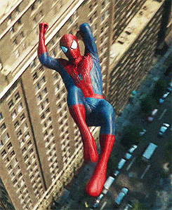
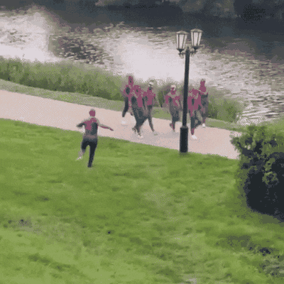

<!-- 🕷️ 这是你的 GitHub 首页，想改内容直接点右上角铅笔编辑即可 -->



<div align="center">

[](https://git.io/typing-svg)


<br/>



</div>

---

## 🕸️ 关于我

```objc
// Ribacha.h —— 你的友好邻居 🕷️
@interface Ribacha : NSObject
@property (nonatomic, copy)   NSString  *motto;    // 能力越大，责任越大
@property (nonatomic, assign) NSInteger  coffee;    // ☕️ 永远差一杯
@end

@implementation Ribacha
- (void)spiderSense {   // 蛛丝感应：bug 靠近时自动报警
    while (![bug isFixed]) {
        [self debug];
        [self drinkCoffee];
    }
}
@end
```

- 🎯 **主业**：iOS 开发，Objective-C++ 就是我的蛛丝
- 🧠 **内功**：死磕计算机基础，喜欢抠底层细节
- 🌱 **修炼中**：新技能一个一个点亮，不着急
- 💬 **欢迎聊**：iOS 底层原理 · 工具折腾 · 蜘蛛侠电影

---

## 🕷️ 装备库

<div align="center">

<a href="https://skillicons.dev">
  
</a>

<br/><br/>


</div>

## 🧠 内功心法

<div align="center">


</div>

---

## 📊 蜘蛛战绩

<div align="center">


<br/>

**🗓️ 贡献之网**（蛛丝织得越密，城市越安全）


</div>

---

## 😆 写 bug 的我 · 修 bug 的我

<div align="center">



</div>

> 🕷️ **能力越大，责任越大。** —— 本叔

---


